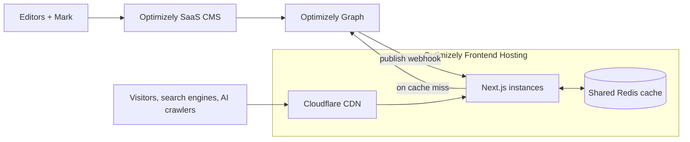

# Content Gurus — Next.js on Optimizely SaaS CMS

The source code for [test.contentgurus.no](https://test.contentgurus.no), the
website of Content Gurus, a Nordic content studio. It's a headless
**Next.js 16** frontend for **Optimizely SaaS CMS**, built with the
[Content JS SDK](https://github.com/episerver/content-js-sdk) and deployed to
**Optimizely Frontend Hosting**. Content is written, translated and enriched
with **Optimizely Mark** (previously Opal).

It's a real, production-style site, published so others building on the same
stack can see how the pieces fit together — and what broke along the way.


<table>
  <tr>
    <td width="33%"></td>
    <td><br><br></td>
  </tr>
</table>

**Mobile Lighthouse** (median of 3 runs, October 2026):

| Page | Performance | Accessibility | Best Practices | SEO |
|---|---|---|---|---|
| Home | 94 | 100 | 100 | 100 |
| Article | 97 | 100 | 100 | 100 |

## Stack

| | |
|---|---|
| **CMS** | Optimizely SaaS CMS with Visual Builder; content delivered by Optimizely Graph |
| **SDK** | `@optimizely/cms-sdk` and `@optimizely/cms-cli` 3.0 |
| **Framework** | Next.js 16.3 (App Router, Cache Components, Partial Prerendering), React 19, TypeScript |
| **UI** | Tailwind CSS 4, shadcn/ui primitives |
| **Languages** | English, Norwegian, Swedish and Danish via next-intl |
| **Hosting** | Optimizely Frontend Hosting: Cloudflare CDN in front of multiple Node instances, with a shared Redis cache |
| **Content** | Optimizely Mark for drafting, translation, images and metadata |



## Features

### Visual Builder content model

Editors build pages from sections, blocks and elements in Visual Builder, and
style them with display templates — surface colours, heading levels,
alignment, spacing — without touching code. The model has 26 content types
and 18 display templates, all defined in TypeScript and pushed to the CMS with
the CLI, plus a read-only `npm run cms:diff` that catches changes made in the
CMS UI before they turn into rejected pushes.

**→ [Content model](docs/content-model.md):** how a page is put together, every
type and what it's for, the component pattern, and the gotchas (reserved
property names, non-localized properties, display settings lost in
compositions).

### GEO: built to be found and cited by AI

The site is about GEO, so it practises it. Every page emits typed JSON-LD
generated from content — articles with a real author entity, FAQ markup built
from accordion blocks, breadcrumbs, organization data — and the site serves
`llms.txt` and `llms-full.txt` in every language. Editors control the signals
through an SEO block with schema type, topics, keywords, voice-assistant
selectors and full JSON-LD overrides, and Mark helps fill them in.

**→ [GEO](docs/geo.md):** every signal the site emits, where it comes from in the
CMS, and the trade-offs (including why `<html lang>` is always `en`).

### Performance

Mobile Performance went from 72 to the mid-90s, with CLS at 0 and Total
Blocking Time in single-digit milliseconds. The biggest wins weren't the
obvious ones: loading the experimentation snippet only where it's used, and
removing fonts that delayed the largest text. Some recommended fixes made
things worse — inlining CSS cost 3 points, and a tool's advice to preload the
hero image targeted an element that a trace showed wasn't the LCP at all.

**→ [Performance](docs/performance.md):** current scores, the Lighthouse harness
with score history, what worked, what didn't, and the last step (HTML caching
at the edge).

### Caching and instant publishing

Pages are rendered on first request and cached in Redis shared by all
instances. When an editor publishes, a webhook revalidates exactly what's
affected — the page, the listings it appears in, `llms.txt`, the sitemap — so
changes are live within seconds without short cache lifetimes. A minor
Next.js upgrade silently broke this twice, in ways `next dev` couldn't show.

**→ [Caching](docs/caching.md):** the cache layers, the publish flow, how to test
invalidation locally with a fake webhook, and what broke.

### And also

- **Live preview:** editors see their draft rendered by this app as they type,
  in Visual Builder and in the regular editor.
- **Images resized at the edge:** a custom `next/image` loader uses the CDN's
  image transformations for CMS and DAM assets instead of resizing on the
  origin.
- **Experimentation:** the Optimizely Web Experimentation snippet is switched
  on from the CMS, without a deploy.

## Latest updates

- **October 2026 — SDK 3.0 and Next.js 16.3.** The upgrade itself was smooth,
  but it silently broke the shared cache handler twice: published pages stopped
  refreshing, and link prefetches failed with 500. Both only show up with
  Redis on a deployed environment.
- **June–August 2026 — Deploying with opticloud.** Deployments moved to the
  `opticloud` CLI; `.zipignore` turned out to be the only thing keeping `.env`
  out of the package.
- **June 2026 — Performance campaign.** A Lighthouse harness with stored
  history, and a series of measured changes from 72 to the mid-90s.

**→ [All updates](docs/updates.md)** — a high-level history with the side
effects and lessons from each milestone, back to the first commit.

## Getting started

You need Node.js 20.9 or newer and an Optimizely SaaS CMS instance. The
quickest way to a running site is to import the complete site — content types,
display templates, pages, blocks and images — from the content package, so
you start with exactly what's on [test.contentgurus.no](https://test.contentgurus.no).

1. **Import the site into the CMS.** Download
   [`content-gurus-2026-10-07.episerverdata`](https://github.com/evest/nextjs-fe-hosting/releases/download/ContentPack/content-gurus-2026-10-07.episerverdata)
   (about 130 MB) from the
   [ContentPack release](https://github.com/evest/nextjs-fe-hosting/releases/tag/ContentPack)
   and import it under **Settings → Import Data** in the CMS. Make sure
   English, Norwegian, Swedish and Danish are enabled under
   **Settings → Languages**.
2. **Create an application.** Under **Settings → Applications**, add an
   application with the imported *Content Gurus* start page as its start
   page, `https://localhost:3000` as the host, and all languages. This tells
   the CMS where the site runs, so URLs resolve and the editor can show the
   preview.
3. **Index.** Run a full Graph index under **Settings** in the CMS, so the
   imported content is available through Graph.
4. **Configure.** Copy `.env.template` to `.env` and fill in the CMS URL, the
   Graph single key and the CMS API client credentials. The variables marked
   as provided by the platform are only needed on Frontend Hosting.
5. **Install and check.**
   ```bash
   npm install              # npm is enforced
   npm run cms:login
   npm run cms:diff         # should report that code and CMS are in sync
   ```
6. **Run.** `npm run dev` and open <https://localhost:3000>. The dev server
   uses HTTPS so the CMS can show it in its preview iframe.

**Starting without the content package?** Skip step 1 and push the content
model from code with `npm run cms:push-config`. You'll then need to create the
pages yourself, starting with a `LandingPageExperience` as the start page for
each language and a *Site Settings* item.

Locally, CMS reads are cached for minutes rather than until the next publish,
because Graph's publish webhook can't reach `localhost`.

## Deploying to Frontend Hosting

```bash
npm run deploy-test2
```

This runs [`opticloud`](https://www.npmjs.com/package/@kunalshetye/opticloud)
(a dev dependency) to package the app, upload it and deploy it to the Test2
environment. Deployment credentials come from `OPTI_*` variables in `.env`
or the environment, or from the OS keychain after `npx opticloud auth:login`.
**`.zipignore` controls what goes into the package — keep `.env` in it.**

The platform provides Redis, the managed identity and the Graph webhook
credentials; the app registers its own publish webhook on startup.

## Scripts

| Command | |
|---|---|
| `npm run dev` | Dev server with HTTPS |
| `npm run build` / `npm start` | Production build and server |
| `npm run lint` | ESLint |
| `npm run cms:diff` | Compare content types in code with the CMS (read-only) |
| `npm run cms:push-config` | Push content types and display templates |
| `npm run deploy-test2` | Deploy to the Test2 environment |
| `npm run lh` | Lighthouse against Test2, median of 3, stored in history |
| `npm run lh:trim` / `lh:history` | Summarise the latest report / show the score trend |

## Project structure

```
src/
  app/                 Routes: localized catch-all, preview, llms.txt, sitemap, robots, publish webhook
  components/          React components by CMS role: pages, blocks, elements, experiences, layout
  content-types/       Content type definitions
  display-templates/   Display templates
  lib/                 Graph reads, JSON-LD, SEO metadata, image loader, cache tags
  optimizely.ts        SDK registries and component resolver
  proxy.ts             Locale routing middleware
  instrumentation.ts   Registers the Graph publish webhook on startup
cache-handler.mjs      Shared Redis cache handler
scripts/               cms:diff and the Lighthouse harness
docs/                  Documentation
```

## Documentation

| Page | |
|---|---|
| [Content model](docs/content-model.md) | Content types, display templates, Visual Builder, syncing with the CMS |
| [GEO](docs/geo.md) | Structured data, `llms.txt`, metadata, sitemap and robots |
| [Performance](docs/performance.md) | Scores, measurement, what worked and what didn't |
| [Caching](docs/caching.md) | Cache layers, publish flow, testing invalidation |
| [Updates](docs/updates.md) | Project history and lessons learned |

## Learn more

- [Content JS SDK](https://github.com/episerver/content-js-sdk) and its
  [samples](https://github.com/episerver/content-js-sdk/tree/main/samples)
- [Hosting a frontend with Optimizely](https://docs.developers.optimizely.com/content-management-system/v1.0.0-CMS-SaaS/docs/host-a-front-end-with-optimizely)
- [Mosey Bank demo](https://github.com/episerver/cms-saas-vercel-demo/) and
  [opti-astro](https://github.com/kunalshetye/opti-astro)
- [Next.js documentation](https://nextjs.org/docs)

## License

[MIT](LICENSE)
