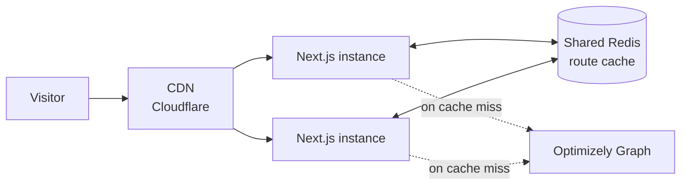
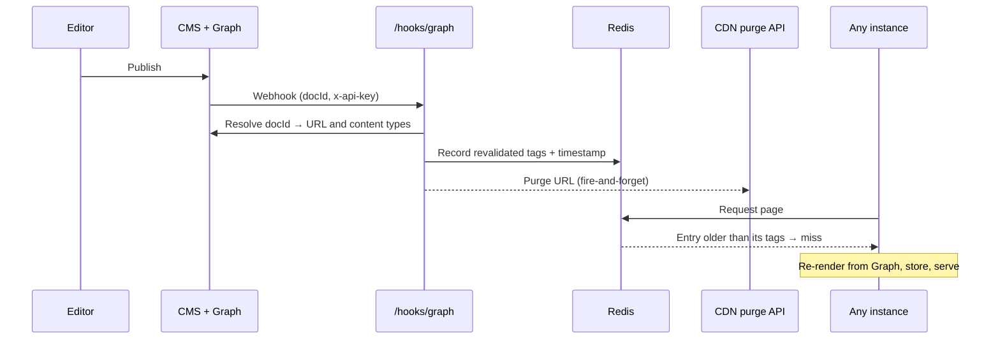

# Caching and instant publishing

Pages are served from a shared cache, and a publish in the CMS refreshes
exactly the affected pages within seconds — on every instance, with no
redeploy and no short cache lifetimes. This page explains how that works on
Optimizely Frontend Hosting, how to test it, and what broke along the way.

## The layers



| Layer | What's cached | Lifetime | Invalidated by |
|---|---|---|---|
| **CDN** | Static JS/CSS, fonts and public assets (1 year, immutable); CMS images (4 hours) | Per header | Deploy (hashed file names), purge API |
| **Route cache (Redis)** | Full pages: HTML, the React Server Component payload and the per-segment prefetch data | Until invalidated | Tag revalidation from the publish webhook |
| **`'use cache'` functions** | Every CMS read: pages, people, listings, site settings, `llms.txt` data | `cacheLife('max')` (hours for the sitemap) | Tags, via the webhook |

**HTML is not cached at the CDN yet.** Next.js already sends
`Cache-Control: s-maxage=2592000, stale-while-revalidate` for cached pages,
but the CDN answers `cf-cache-status: DYNAMIC` — it passes HTML through to the
origin. Turning on HTML caching at the edge is the next performance step; see
[CDN HTML caching](cdn-html-caching.md) and [performance](performance.md).

### Why the cache has to be shared

Frontend Hosting runs several instances of the app behind the CDN. Next.js's
default caches live in each instance's memory, so a publish webhook that
reaches one instance would leave the others serving old pages. The fix is a
**custom cache handler** ([`cache-handler.mjs`](../cache-handler.mjs)) that
stores the route cache in the Redis cluster the platform provides, plus
`cacheMaxMemorySize: 0` in [`next.config.ts`](../next.config.ts) so Next.js
keeps no per-instance copy. Redis is then the single source of truth. Results
of `'use cache'` functions are stored as part of the page that used them; the
directive's main job here is to attach cache tags and lifetimes.

The handler started as Optimizely's reference implementation and is
connected with the platform's managed identity. Locally, without Redis, it
falls back to an in-memory map.

### Pages render on first request, not at build time

`generateStaticParams` returns only one placeholder per locale, so the build
does not prerender any CMS pages. Each page is rendered and cached on its first
request, then served from cache until it's invalidated.

That's deliberate. The build container sometimes saw ~50 s latency to Graph,
which exceeds Next.js's limit for filling a `'use cache'` entry during the
build, and prerendering every page makes builds slower as content grows. The
cost is one uncached render per page after each deploy.

## What happens when an editor publishes



The webhook ([`src/app/hooks/graph/route.ts`](../src/app/hooks/graph/route.ts)):

1. **Authenticates** the request with the `x-api-key` header.
2. **Resolves** the published `docId` (`{guid}_{locale}_Published`) to a URL
   and content types with one Graph query.
3. **Revalidates** everything the change can affect:
   - the page's path and its page tag (`opti-page:en/blog/my-post`);
   - the article-list tags of every parent path (`/en/` and `/en/blog/`), so
     listings that include the page refresh too. Revalidating a tag no entry
     uses costs nothing, so overshooting is fine;
   - the `llms.txt` index and the sitemap's path list;
   - for **Site Settings**, every page: the root layout is revalidated and the
     whole CDN is purged, because settings (like the experimentation snippet)
     affect every page.
4. **Purges** the URL from the CDN through Optimizely's Cloud Platform
   Services API, without waiting for the result.
5. **Always returns 200**, so Graph doesn't retry on downstream failures.

The webhook is **registered automatically** at startup in
[`src/instrumentation.ts`](../src/instrumentation.ts). It lists Graph's
existing webhooks, does nothing if exactly one points at this site, removes
duplicates if parallel instances raced, and registers one if none exists.
It never deletes and re-creates, because publishes in that gap would be lost.

### How tag invalidation works

Next.js gives the cache handler a `revalidateTag(tags)` call and expects
`get()` to stop returning entries that carry those tags. Our handler:

- **On `revalidateTag`**, stores each tag with the current time in one Redis
  hash.
- **On `get`**, reads the entry's tags — for pages they're in the entry's
  `x-next-cache-tags` header, which includes path tags such as `_N_T_/en` and
  every `cacheTag()` the page used — and looks up their times with a single
  `HMGET`. If any tag was revalidated after the entry was written, it's a
  miss, and Next.js re-renders.

This doesn't depend on how Next.js names its cache keys, which is exactly
what broke in Next.js 16.3 (below).

## Testing invalidation locally

`next dev` doesn't exercise any of this: there's no Redis, the in-memory
fallback never serializes, and Graph can't reach `localhost` with webhooks. A
production server can, with a fake webhook call:

```bash
npm run build
OPTIMIZELY_GRAPH_CALLBACK_APIKEY=localtest npx next start -p 3100

# Warm the cache: the second request should say HIT
curl -sI http://localhost:3100/en | grep x-nextjs-cache

# Publish event for the page (use the page's content GUID)
curl -X POST http://localhost:3100/hooks/graph \
  -H "x-api-key: localtest" -H "content-type: application/json" \
  -d '{"type":{"subject":"doc","action":"updated"},"data":{"docId":"<guid>_en_Published"}}'

# Should now be MISS (re-rendered), then HIT again
curl -sI http://localhost:3100/en | grep x-nextjs-cache
```

This checks the tag logic, not Redis serialization. For that, deploy and
confirm a real publish shows up — see [updates](updates.md) for why that last
step matters.

In local development, CMS reads use `cacheLife('minutes')` instead of
`'max'`, so edits show up without a webhook.

## Preview is never cached

The Visual Builder preview route (`/preview`) reads content inside a
`<Suspense>` boundary without `'use cache'`, so every request goes to Graph
and editors always see the latest draft. It sits outside the locale routing
and is excluded in `robots.txt`.

## What broke along the way

A custom cache handler depends on Next.js internals, and every one of these
bugs passed `next dev` and a local build:

- **Buffers became `[object Object]`.** Route handlers (`robots.txt`, the
  sitemap, `llms.txt`) are cached with a `Buffer` body. `JSON.stringify` turns
  a Buffer into `{type:"Buffer",data:[…]}`, which never turns back. The
  handler now encodes Buffers explicitly.
- **Next.js 16.3: publishes stopped showing.** Route cache keys changed from
  `/en` to `/route-cache/APP_PAGE/<sha256 of the route>/$/en`. The reference
  handler mapped the `_N_T_/en` tag to the key `/en` and deleted it, which
  silently became a no-op. Pages stayed stale until the next deploy. Fixed by
  the timestamp approach above.
- **Next.js 16.3: link prefetches returned 500.** Page entries gained
  `segmentData`, a `Map<string, Buffer>`. `JSON.stringify` turns a Map into
  `{}`, so every segment prefetch of a cached page failed. The handler now
  round-trips Maps as well.

**After any Next.js upgrade:** reread the cache handler contract
(`next/dist/server/lib/incremental-cache/`), and verify on a deployed
environment that a publish in the CMS shows up on the site.

## Key files

| File | Purpose |
|---|---|
| [`cache-handler.mjs`](../cache-handler.mjs) | Shared Redis route cache, tag timestamps, serialization |
| [`next.config.ts`](../next.config.ts) | `cacheComponents`, `cacheHandler`, `cacheMaxMemorySize: 0` |
| [`src/app/hooks/graph/route.ts`](../src/app/hooks/graph/route.ts) | Publish webhook: revalidation and CDN purge |
| [`src/instrumentation.ts`](../src/instrumentation.ts) | Registers the webhook with Graph at startup |
| [`src/lib/cache/cache-keys.ts`](../src/lib/cache/cache-keys.ts) | Cache tag names |
| [`src/lib/cdn-cache.ts`](../src/lib/cdn-cache.ts) | CDN purge API client |
| [`src/lib/optimizely/get-page.ts`](../src/lib/optimizely/get-page.ts) | The cached, tagged page read |

## Further reading

- [Optimizely's ISR reference](isr-documentation.md) — the reference
  implementation this started from
- [Caching and ISR plan](caching-and-isr-plan.md) — the original design (April
  2026); parts have since changed, such as prerendering at build time
- [CDN HTML caching](cdn-html-caching.md) — the edge caching design
