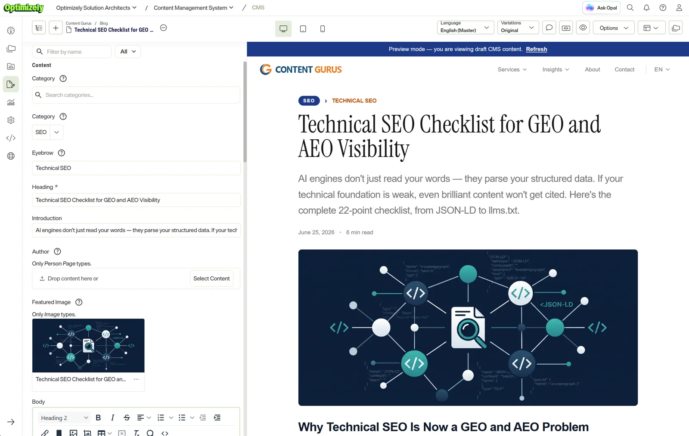
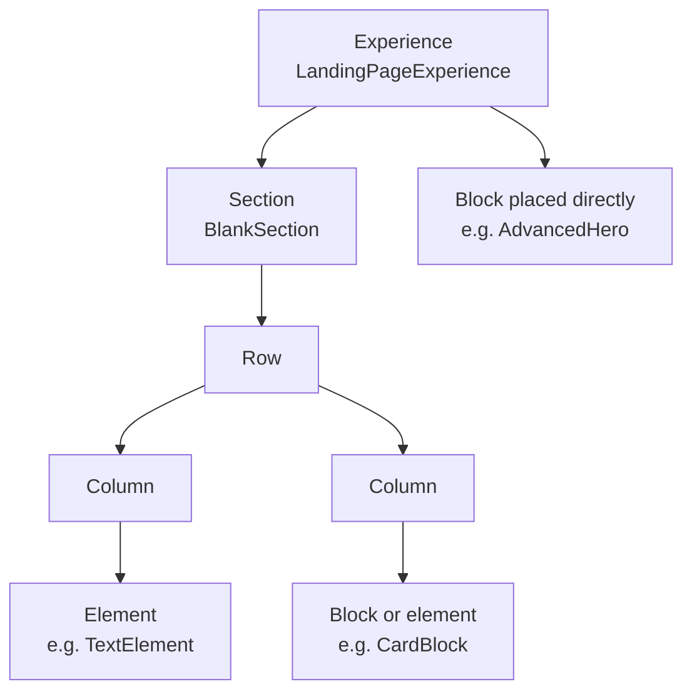

# Content model

All content types are defined in TypeScript with the
[Content JS SDK](https://github.com/episerver/content-js-sdk) and pushed to
the CMS with its CLI, so the content model is versioned with the code that
renders it. Editors build most pages visually in Visual Builder from
**experiences, sections, blocks and elements**, and adjust their look with
**display templates**.

The repo defines **26 content types** and **18 display templates**.



*Editing an article: the fields on the left come from the `ArticlePage`
content type; the preview on the right is this Next.js app rendering the
draft.*

## How a page is put together



- **Experiences** are pages built in Visual Builder. They hold sections, and
  blocks can also be placed directly in them.
- **Sections** contain a grid of rows and columns. This site uses the CMS's
  built-in `BlankSection`, styled by a display template.
- **Blocks and elements** are `_component` types. `sectionEnabled` lets a type
  be placed as a section of its own; `elementEnabled` lets it be placed inside
  a column. Element-enabled types can't contain content areas or other
  components.
- **Pages** (`_page`) are classic structured pages with fixed fields, used
  where every page should look the same — articles and people.

## Content types

**Pages and experiences**

| Type | Base | Purpose |
|---|---|---|
| `LandingPageExperience` | `_experience` | Visual Builder pages, including the start pages. Full-bleed background image behind a transparent header. |
| `ArticlePage` | `_page` | Blog posts and customer stories: eyebrow, category, ingress, rich text body, featured image, author (a reference to a person), extra content area |
| `PersonPage` | `_page` | A person's profile, also used as an article's author |
| `SiteSettings` | `_page` | Singleton per locale: site name, logo, organization data for structured data, `llms.txt` description, experimentation snippet ID |

The CMS's built-in `BlankExperience` and `BlankSection` also have
components here.

**Blocks** (can be placed as sections)

| Type | Also an element | Purpose |
|---|---|---|
| `AdvancedHero` | | Start page hero: eyebrow, headline with emphasis, body, two calls to action, "trusted by" list |
| `HeroBlock` | ✓ | General hero: headline, subline, background image, two calls to action |
| `StatsBlock` | | Key figures |
| `TestimonialBlock` | ✓ | Customer quotes |
| `ProcessBlock` | ✓ | Numbered steps |
| `CalloutBanner` | ✓ | Highlighted message with a call to action |
| `SolutionsGrid` | | A grid of `SolutionTile` elements |
| `PartnerLogos` | | Logo strip |
| `AccordionBlock` | | FAQ list of `AccordionItem`s; also emits FAQ structured data |
| `ArticleListBlock` | ✓ | Latest articles under a parent page, queried from Graph |
| `CardBlock` | ✓ | Image card with link |
| `ContactFormBlock` | ✓ | Contact form, inline or in a modal dialog |

**Elements** (placed in columns)

`TextElement`, `RichTextElement`, `ImageElement`, `BannerElement`,
`CallToActionElement`, `PageCardElement` (a card for a referenced page),
`PersonElement` (a card for a referenced person), `SolutionTile` and
`AccordionItem`.

**Embedded only**

`SeoBlock` is never placed on its own; every page and experience has one as a
property. It holds meta tags and the structured-data overrides described in
[GEO](geo.md).

## Display templates

Display templates are the styling options editors see in Visual Builder's
sidebar. The rule in this codebase: **what the content says** goes in content
type properties, **how it looks** goes in display templates. The same
testimonial can then be shown on a dark or a light surface without duplicating
it.

Most block templates share a `surface` setting (dark, light, muted, image…),
so sections can be combined into a page with a consistent rhythm. Examples:

| Template | For | Settings |
|---|---|---|
| `HeroBlockDisplayTemplate` | `HeroBlock` | surface, height, alignment, image dim |
| `ImageElementDisplayTemplate` | `ImageElement` | alignment, size, aspect ratio, radius, shadow, spacing |
| `TextElementDisplayTemplate` | `TextElement` | heading level, alignment |
| `BlankSectionDisplayTemplate` | sections | colour scheme, section spacing, row/column/element gaps |
| `RowDisplayTemplate`, `ColumnDisplayTemplate` | grid nodes | spacing, vertical alignment, hide on mobile/tablet |
| `LandingPageExperienceDisplayTemplate` | experiences | full-bleed image, header style, background treatment |

## Defining a type and its component

A content type is a typed object:

```ts
// src/content-types/TextElement.ts
export const TextElementCT = contentType({
  key: 'TextElement',
  displayName: 'Text',
  description: 'Plain-text snippet — short headlines, labels or paragraphs placed inline.',
  baseType: '_component',
  compositionBehaviors: ['elementEnabled'],
  properties: {
    text: { type: 'string', displayName: 'Text', isRequired: true, isLocalized: true },
  },
});
```

The component gets typed props inferred from the type and its display
template (simplified):

```tsx
// src/components/elements/TextElement.tsx
type Props = {
  content: ContentProps<typeof TextElementCT>;
  displaySettings?: ContentProps<typeof TextElementDisplayTemplate>;
};

export default function TextElement({ content, displaySettings }: Props) {
  const { pa } = getPreviewUtils(content);
  const level = displaySettings?.headingLevel ?? 'plain';
  return <Heading level={level} {...pa('text')}>{content.text}</Heading>;
}
```

`pa('text')` adds the attributes Visual Builder needs to make the field
editable in place; `src(image)` from the same helper returns an image URL.

**A new type is registered in four places:** the content type registry
([`src/content-types/index.ts`](../src/content-types/index.ts)), the
component exports ([`src/components/index.ts`](../src/components/index.ts)),
the resolver map in [`src/optimizely.ts`](../src/optimizely.ts), and the CLI
config ([`optimizely.config.mjs`](../optimizely.config.mjs)).

Two thin wrappers sit in front of the SDK helpers:

- [`src/lib/content-type.ts`](../src/lib/content-type.ts) allows a top-level
  `description`, which the CMS shows to editors but the SDK's types don't
  include.
- [`src/lib/display-template.ts`](../src/lib/display-template.ts) keeps
  setting choices as literal types. Without it, since SDK 2.2, every select
  setting is inferred as `never`, and comparisons like
  `alignment === 'center'` don't compile.

## Syncing with the CMS

```bash
npm run cms:diff          # read-only: what differs between code and the CMS
npm run cms:push-config   # push the content types and display templates
```

**Run `cms:diff` before every push.** Content types can also be edited in the
CMS UI, and a push is rejected as a breaking change when the CMS has changes
the code lacks, such as a property made localized or a property added there.
The CLI stops at the first type it rejects, so without `cms:diff` you find
the drift one type at a time. Avoid `--force` until you know who changed what
in the CMS and why.

## Rendering compositions

Experiences are rendered with the SDK's `OptimizelyComposition`. One detail
cost us time: it passes a node's display settings to the wrapper component,
not to the block inside it. A block placed directly in an experience (not in
a section) never received its display template values. The experience
components here pass them through explicitly
([`LandingPageExperience.tsx`](../src/components/experiences/LandingPageExperience.tsx)).

## Gotchas

- **Some names are reserved.** Property group names `content` and `settings`,
  and the property name `pageLink`, are rejected or misbehave.
- **Display template choice keys need at least two characters**, so
  `overlay0`, not `0`.
- **A property that isn't localized is shared by all languages,** even if
  the components inside it have localized fields; translations written to it
  are silently dropped. `AccordionBlock.items` had this problem until it was
  made localized. Changing localization on a property that already holds
  content is a breaking change: the push needs `--force`, existing values stay
  in the default language, and the other languages start empty.
- **URL properties are objects** (`{ default: … }`), not strings.
- **Images from the DAM have `url.default` set to `null`.** Use the SDK's
  `src()` helper to resolve them, not the URL field.

## Key files

| Path | Contents |
|---|---|
| [`src/content-types/`](../src/content-types/) | Content type definitions |
| [`src/display-templates/`](../src/display-templates/) | Display templates |
| [`src/components/`](../src/components/) | Components by role: `pages/`, `blocks/`, `elements/`, `experiences/`, `layout/` |
| [`src/optimizely.ts`](../src/optimizely.ts) | Registries and the component resolver |
| [`optimizely.config.mjs`](../optimizely.config.mjs) | CLI config: which types are pushed |
| [`scripts/cms-diff.mjs`](../scripts/cms-diff.mjs) | The drift check |
